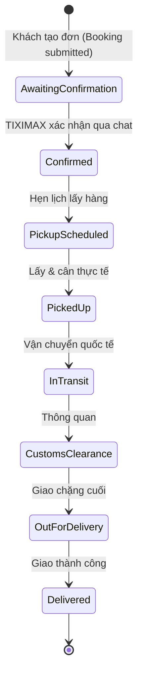
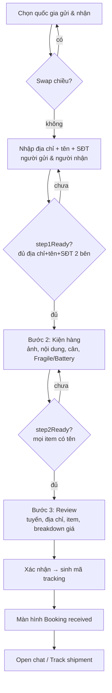
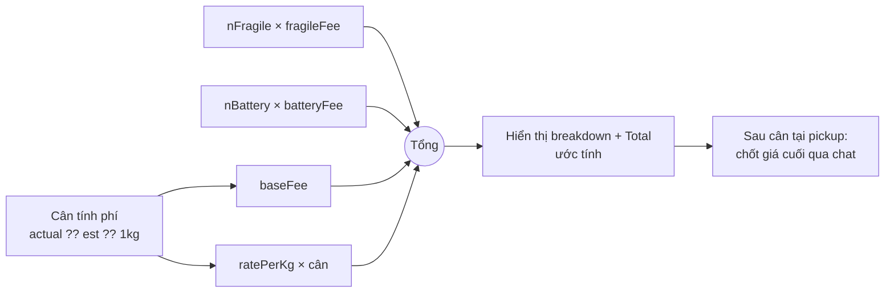
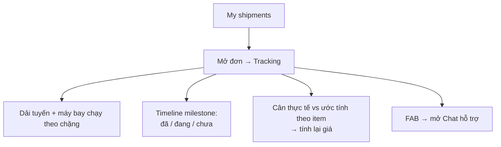
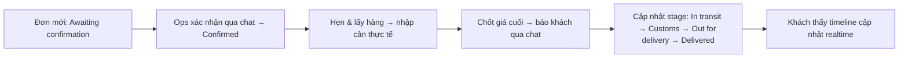

# 5. Luồng nghiệp vụ

> Mô tả các luồng chính, bám theo prototype. Sơ đồ dùng cú pháp Mermaid.

## 5.1. Vòng đời đơn hàng (tổng quát)



Ánh xạ chi tiết `stage → status` và khác biệt milestone mobile (6) vs web (7): xem [§4.7](04-mo-hinh-du-lieu.md#47-trạng-thái-đơn-stage--status).

**Điểm chốt nghiệp vụ:** Giá lúc đặt là **ước tính**. Sau khi lấy & **cân thực tế tại pickup**, TIXIMAX xác nhận **giá cuối qua chat** trước khi ship.

## 5.2. Luồng đặt đơn (Booking wizard 3 bước)



**Chi tiết bước:**

1. **Route & addresses** — chọn `originCountry`/`destCountry`, swap đảo chiều (đảo cả quốc gia lẫn thông tin 2 bên). Nhập địa chỉ có gợi ý theo quốc gia (Recent/Suggested/Saved trên mobile, có "Scan address" & "Pick on map"), ZIP tùy chọn, tên + SĐT (mã vùng) mỗi bên, ghi chú lấy hàng (web).
2. **Package details / Items** — ảnh kiện (nhiều, `image/*`), nội dung, cân ước tính (hiện đơn giá & tổng tạm tính realtime), cờ Fragile/Battery. Web hỗ trợ nhiều item.
3. **Review** — dải tuyến (from→to, ETA "5–7 ngày"), tóm tắt địa chỉ/liên hệ, danh sách item + tổng cân + đơn giá/kg + breakdown + tổng.

**Gating:** không cho sang bước sau nếu chưa đủ điều kiện (`step1Ready`/`step2Ready`).

## 5.3. Luồng tính giá (Quote)



Công thức & hằng số: [§4.5](04-mo-hinh-du-lieu.md#45-entity-quote-báo-giá). Trong sản phẩm thật, tính toán chính thức đặt ở **Pricing service** (§3.7).

## 5.4. Luồng theo dõi đơn (Tracking)



- Trạng thái hiển thị theo màu (green/blue/gold/grey) suy từ `stage`.
- Khi có cân thực tế, giá được tính lại và so với ước tính ban đầu.

## 5.5. Luồng chat hỗ trợ

```mermaid
sequenceDiagram
    participant K as Khách
    participant A as Agent (Rina / TIXIMAX Support)
    K->>A: Mở chat (từ tab / FAB / sau khi đặt)
    Note over A: Trạng thái "Online · replies in minutes"
    K->>A: Chọn quick-reply hoặc gõ tin
    A-->>K: Typing indicator
    A->>K: Trả lời (canned/thật) + có thể kèm thẻ đơn
    K->>A: Đính kèm ảnh/tài liệu (web: img/pdf/doc/xls/zip)
    Note over K,A: Badge chưa đọc cập nhật; tin hệ thống khi có sự kiện đơn
```

Tin nhắn 3 loại `who`: `agent | me | system`. Sự kiện đơn (vd đặt đơn thành công) sinh tin `system` trong chat.

## 5.6. Luồng vận hành nội bộ (Ops) *(Đề xuất — chưa có trong prototype)*

Để tracking/chat là thật (không mô phỏng), cần luồng ops tối thiểu:



## 5.7. Điều hướng

- **Mobile:** bottom tab bar 3 tab — **New booking** / **My shipments** / **Chat** (có dot chưa đọc). Back trong màn hình, FAB chat ở tracking.
- **Web:** top nav — **New booking** / **My shipments** / **Chat**. Tracking mở từ danh sách đơn (nav vẫn sáng "My shipments").
- **Theme:** light/dark, lưu localStorage.

## 5.8. Ca ngoại lệ cần xử lý (khi lên sản phẩm)

| Tình huống | Xử lý đề xuất |
|---|---|
| Địa chỉ không nằm trong vùng phục vụ | Cảnh báo sớm ở bước 1, chặn hoặc gợi ý liên hệ |
| Mạng rớt khi xác nhận đơn | Idempotency key, retry, không tạo trùng đơn |
| Upload ảnh lỗi/quá lớn | Nén client, báo lỗi rõ, cho thử lại |
| Cân thực tế lệch nhiều so với ước tính | Chốt lại giá qua chat, cần khách xác nhận trước khi ship |
| Khách đóng app giữa wizard | Lưu nháp đơn (draft) để tiếp tục sau |
| Cờ Battery / hàng cấm | Kiểm tra ràng buộc vận chuyển hàng không, cảnh báo |
